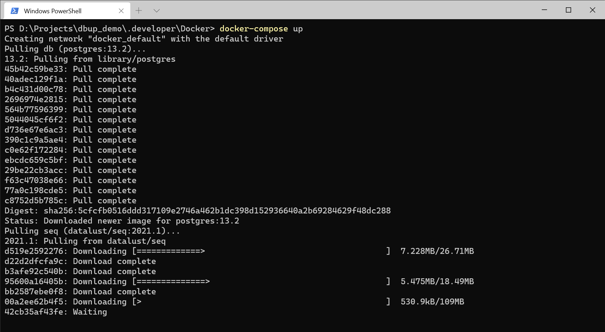
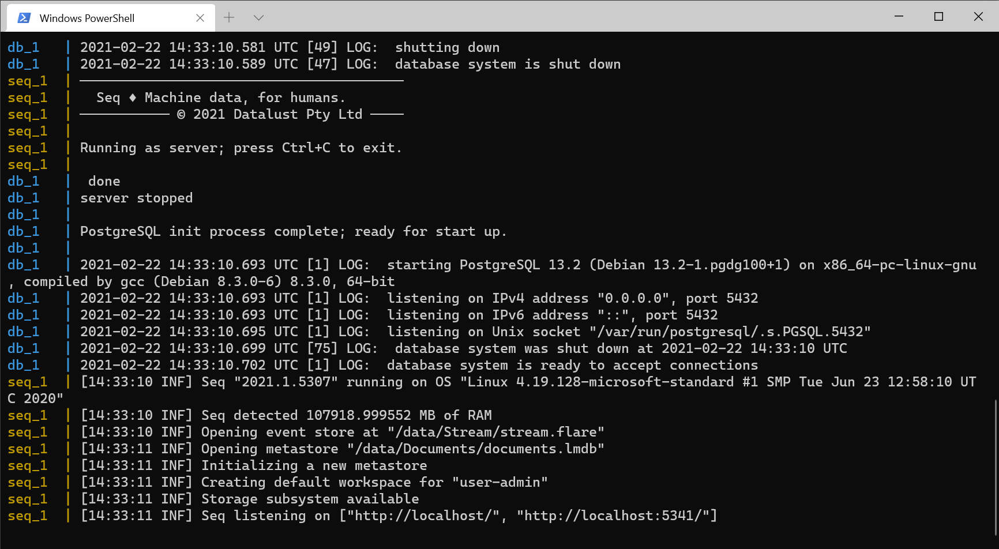
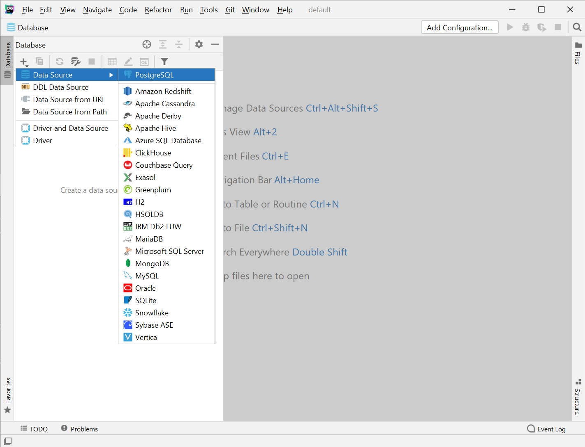
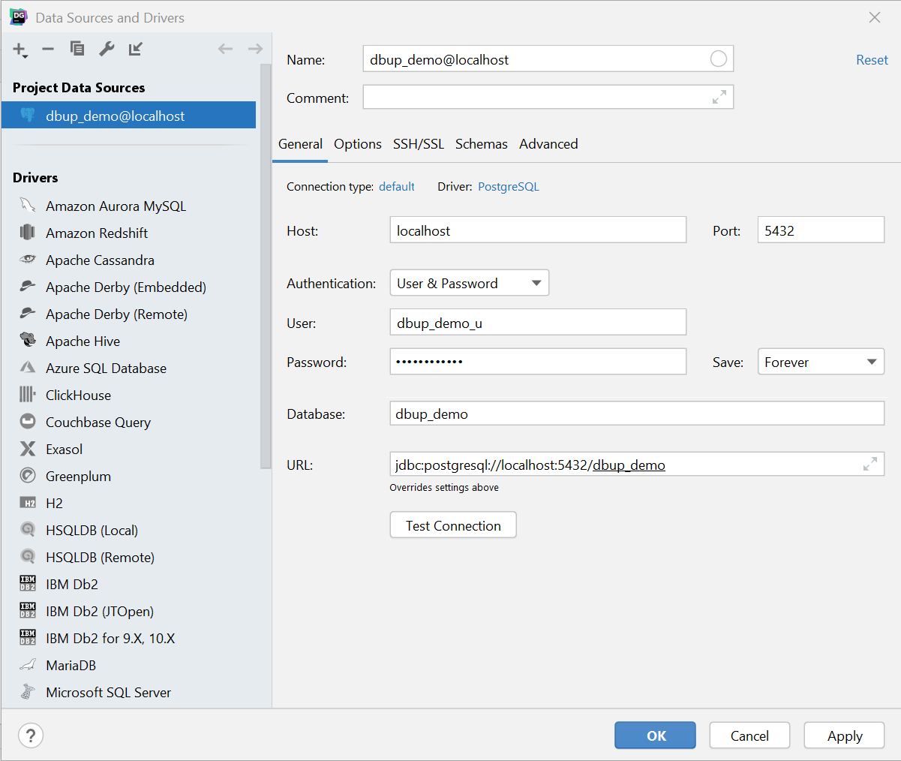
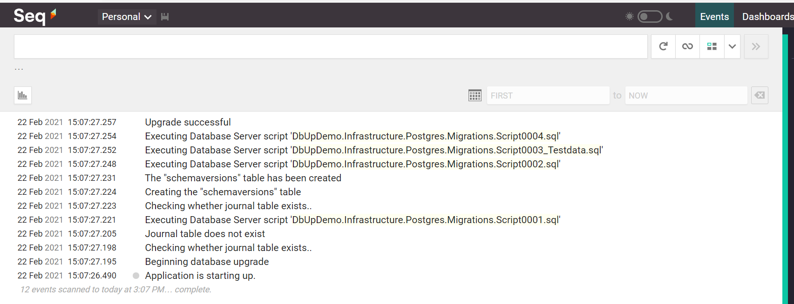
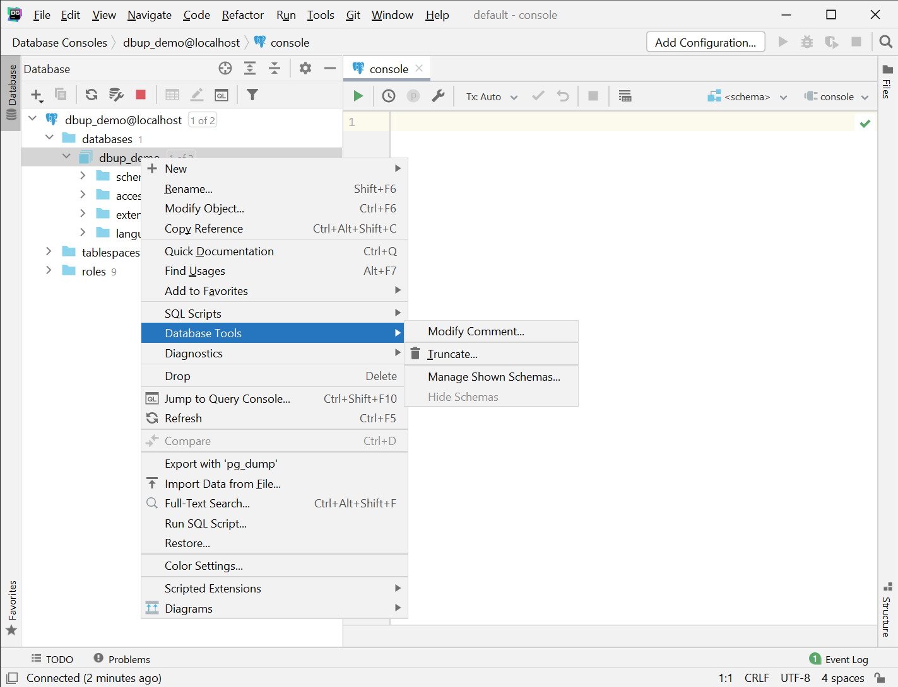
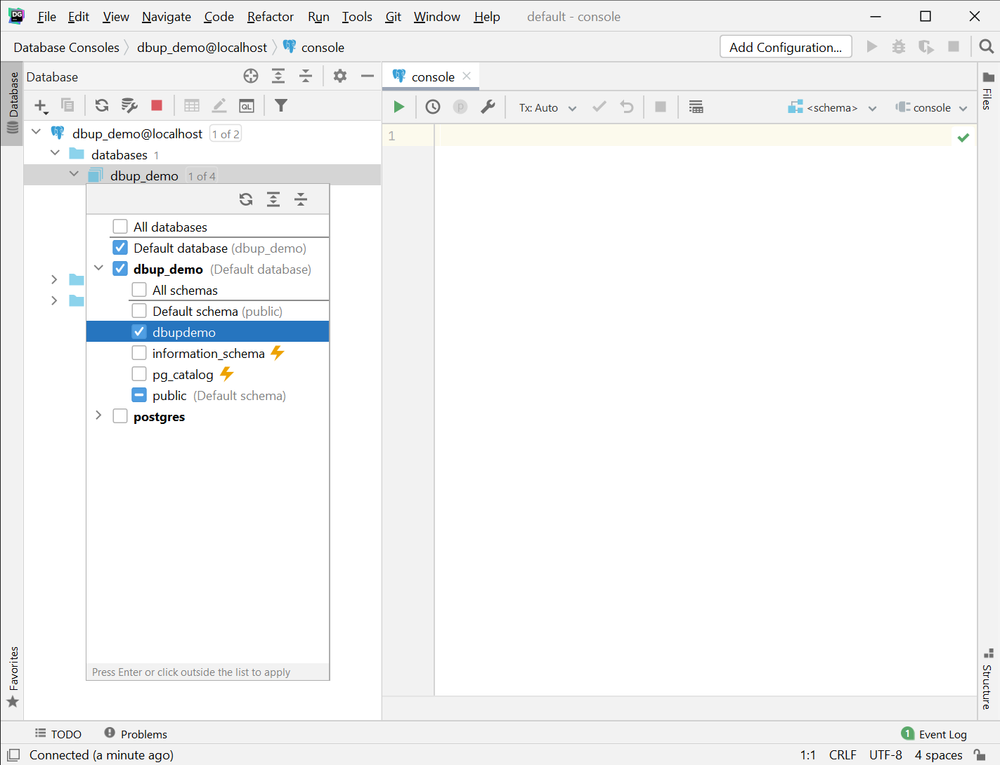
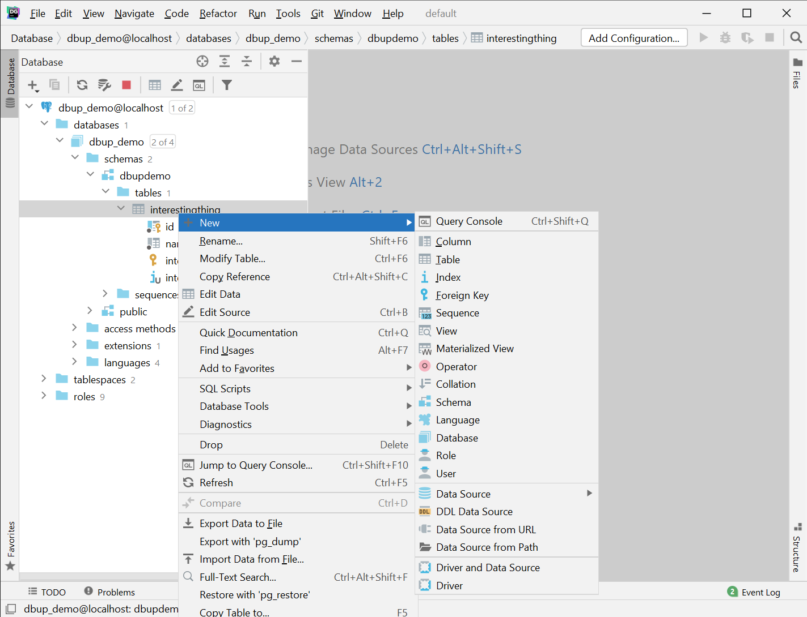
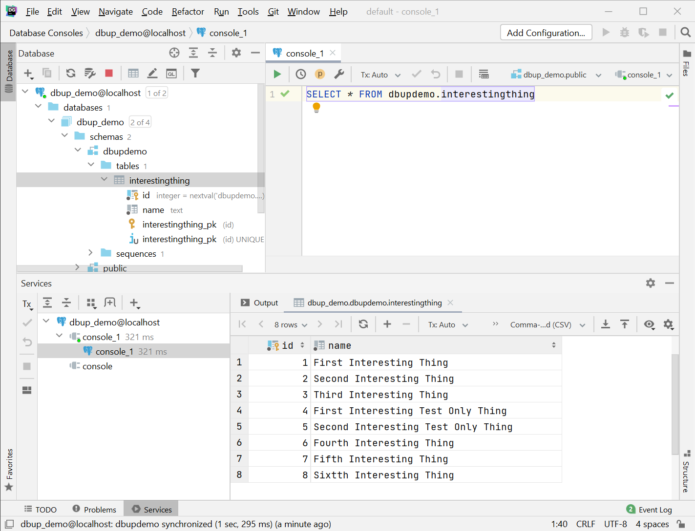
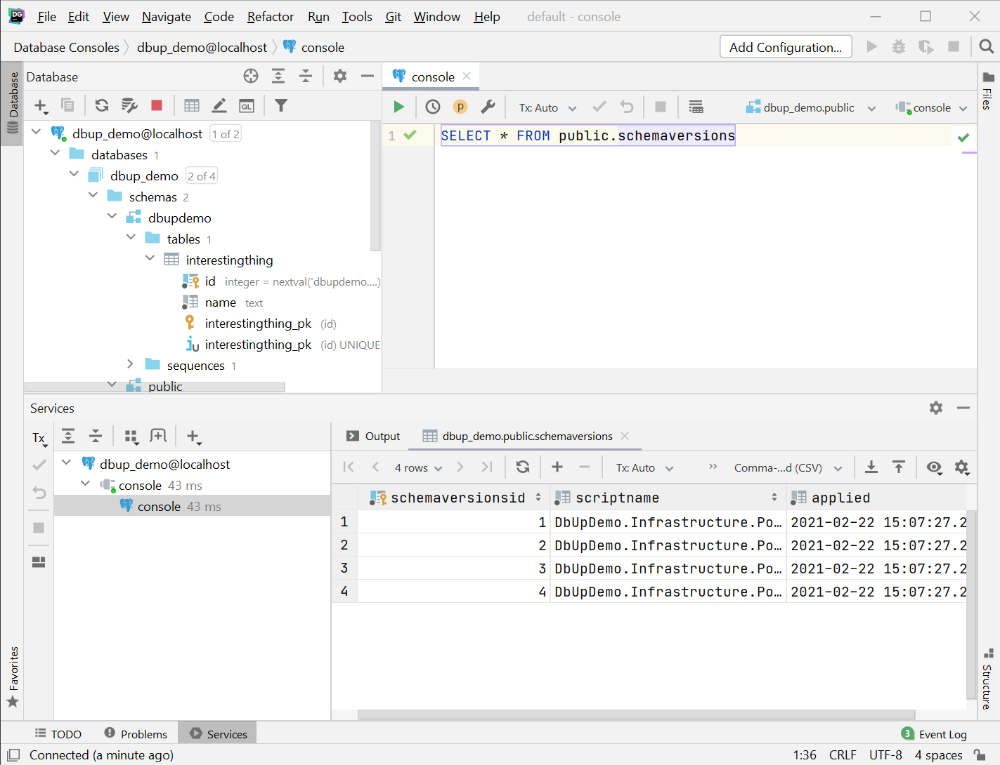

# DbUp Demo
DbUp is a .NET library that helps you deploy changes to SQL Server database. It tracks which SQL scripts have been run already, and runs the change scripts that are needed to get your database up to date. There is support for a variety of database platforms, including PostgreSQL. There is a good amount of documentation available at [https://dbup.readthedocs.io/en/latest/](https://dbup.readthedocs.io/en/latest/) and hopefully this project will show a little bit of what is possible in a form that meets our idioms.

## Getting Started
Clone the repo and cd into the Docker directory with the .developer area. Issue `docker-compose up`, this will pull the required images and start up the configured services. At this point you should be able to connect to the PostgreSQL database using your RDBMS client of choice, I've used [JetBrains' DataGrip](https://www.jetbrains.com/datagrip/) which is part of my licence.

Once the images have been pulled, then new containers will be created based on those images following the instructions in the docker-compose.yml file.

At this point it will be possible to connect to the PostgreSQL database which has been created and is hosted on port 5432. You will also be able to navigate to [seq](http://localhost:5341). I've included some instructions as to how you can connect to PostgreSQL using [JetBrains' DataGrip](https://www.jetbrains.com/datagrip/), if you are using a different tool, please refer to it's help.

First step is to add a new PostgreSQL Data Source which you can find via the + icon in the Database pane.

Using the username, password, and database values from the docker-compose.yml file, you can configure the data source, and click the "Test Connection" to ensure that the details are correct. Once done, click the OK button.

Our database doesn't have any interesting data in it yet though, for that we need to start the application. Run the solution with web project as the start up project. Take a look at the output in [seq](http://localhost:5341). Note that the application has started up and located four scripts.

- Script0001.sql configures the base schema, along with initial tables
- Script0002.sql inserts some base data
- Script0003_Testdata.sql inserts some base data which is for test environments
- Script0004.sql inserts some additional data

Notice how the scripts executed are naturally sortable and are processed in that order. Let's take a look and see what's in the database. To do that we need to configure some more options in DataGrip. First we need to opt into seeing our dbupdemo schema, this is done via the "Manage Shown Schemas..." Database Tool.

Once that is done, you may need to refresh your Database pane, we can then create a new Query Console.

This allows us to query the table we've created and see that data that has been created.

If you query the schemaversions table from the public schema, you will see which scripts were run and when.

But there is a problem, we have a typo in our data, the `Sixtth Interesting Thing` is misspelt. Let's correct that.

## Evolving the data
From this setup, we can see that there are several important pieces of information to take away.

- The scripts are applied one after the other based on their naturally sorted order
- The public.schemaversions table is consulted upon application start up and any script which has not been executed will be executed

Because the public.schemaversions table maintains a log of which scripts have been executed, it is **very** important that the scripts be considered [immutable](https://dictionary.cambridge.org/dictionary/english/immutable) so that we have a consistent deployment mechanism of the baseline dataset. If we were to simple open the `Script_0004.sql` file and amend it, then environments which had not received that file would receive the fixed version, but other environments would be left with `Sixtth...` as the public.schemaversions table will have recorded the fact that that script has been executed.

To fix this, we must add another scripts to our solution. To ensure they are run in the correct order, we need to:

- Add `Script_0005.sql` alongside the other scripts
- Mark it as an embedded resource (so DbUp can locate it)
- Perform the necessary update

Feel free to try this and run the application again in order to check that the appropriate change has been made. Feel free to compare with the `feature/add-script-5` branch in the github repo.

## Behind the curtain
Within the DbUpDemo.Infrastructure.Postgres project you should find a `Migrations` folder containing the `Scaffold.cs` file. This includes a class which is called during application startup. This class determins where to find scripts and which should be considered for execution. As we have a need to have some scripts excluded from production environments, we have specified a filter which will inspect each Embedded Resource name and only allow the correct ones through for certain environments. This includes an example as to how that can be done, specifics that fit with your needs can be applied.

The other important thing to consider is how to manage multiple application starting up _at the same time_. PostgreSQL does have a feature called [advisory locks](https://vladmihalcea.com/how-do-postgresql-advisory-locks-work/) which look promising in this area. Consult with our database experts and agree a way forward which they are comfortable with. I have applied `pg_advisory_xact_lock` in this example application.